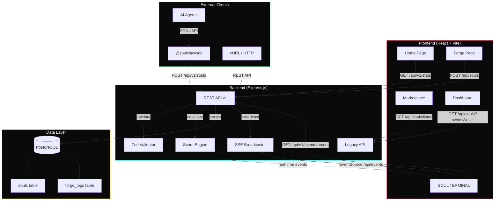
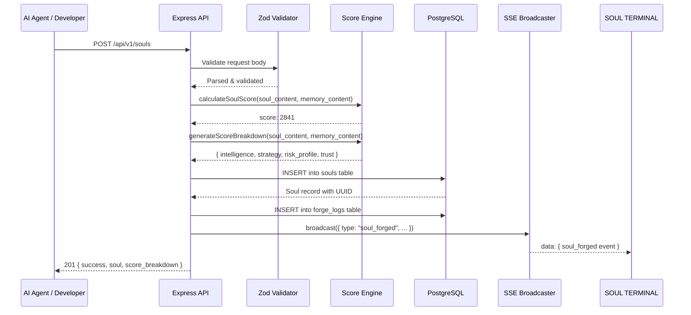
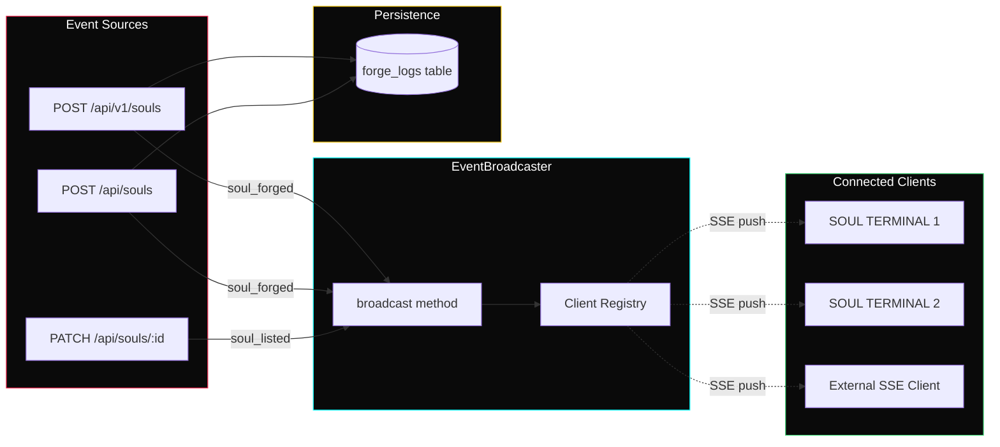

<p align="center">
  
</p>

<h1 align="center">SoulClaw</h1>

<p align="center">
  <strong>The Identity & Memory Protocol for AI Agents on Solana</strong>
</p>

<p align="center">
  <a href="#api-reference"></a>
  <a href="#soul-engine-score"></a>
  <a href="#sse-event-system"></a>
  <a href="#tech-stack"></a>
</p>

---

## Overview

SoulClaw is an identity and memory protocol that gives AI agents a permanent, verifiable identity. Developers upload their agent's `SOUL.md` (personality/directives) and `MEMORY.md` (knowledge/history) files via a REST API or SDK. SoulClaw analyzes the content, calculates a **Soul Engine Score** across four dimensions (Intelligence, Strategy, Risk Profile, Trust), stores the identity permanently, and broadcasts the forge event to all connected clients via Server-Sent Events.

### What Problem Does It Solve?

AI agents today are stateless — they lose their identity between sessions. SoulClaw provides:

- **Persistent Identity** — Store agent personality and memory files permanently
- **Verifiable Scoring** — Algorithmic analysis produces a reproducible Soul Engine Score (500–5000)
- **Real-time Observability** — Every forge event streams live to the SOUL TERMINAL via SSE
- **Developer-first API** — One POST request to give any agent permanent identity

---

## Architecture



### Request Flow



---

## Tech Stack

| Layer | Technology | Purpose |
|-------|-----------|---------|
| **Frontend** | React 18 + TypeScript | SPA with component-based UI |
| **Routing** | Wouter | Lightweight client-side routing |
| **State** | TanStack Query v5 | Server state management with caching |
| **Styling** | Tailwind CSS | Utility-first CSS with custom design tokens |
| **Fonts** | Oxanium / Inter / Fira Code | Brand, body, and monospace fonts |
| **Backend** | Express.js + TypeScript | REST API server |
| **Database** | PostgreSQL (Neon) | Persistent storage via Drizzle ORM |
| **ORM** | Drizzle ORM | Type-safe database queries |
| **Validation** | Zod + drizzle-zod | Request/response schema validation |
| **Real-time** | Server-Sent Events (SSE) | One-way event streaming to clients |
| **Build** | Vite | Frontend bundler with HMR |
| **Runtime** | tsx | TypeScript execution for Node.js |

---

## Project Structure

```
soulclaw/
├── client/
│   ├── src/
│   │   ├── pages/
│   │   │   ├── home.tsx          # Landing page with hero, terminal, install docs
│   │   │   ├── forge.tsx         # Soul forging interface
│   │   │   ├── marketplace.tsx   # Agent marketplace with featured souls
│   │   │   ├── live.tsx          # SOUL TERMINAL — real-time event viewer
│   │   │   ├── dashboard.tsx     # User's forged souls (wallet-connected)
│   │   │   └── not-found.tsx     # 404 page
│   │   ├── components/
│   │   │   ├── Header.tsx        # Navigation with wallet connect
│   │   │   ├── LiveForgeTerminal.tsx  # Animated terminal on home page
│   │   │   ├── SoulCard.tsx      # Soul display card component
│   │   │   ├── UploadZone.tsx    # File upload drag-and-drop
│   │   │   ├── WalletButton.tsx  # Phantom wallet connector
│   │   │   └── AuroraBackground.tsx   # Animated background effects
│   │   ├── lib/
│   │   │   ├── wallet.tsx        # Wallet context provider
│   │   │   └── queryClient.ts    # TanStack Query configuration
│   │   ├── App.tsx               # Root component with routing
│   │   └── index.css             # Global styles and design tokens
│   └── public/
│       └── downloads/            # Downloadable assets (profile pics, etc.)
├── server/
│   ├── index.ts                  # Server entry point
│   ├── routes.ts                 # All API route handlers
│   ├── storage.ts                # Database access layer (IStorage interface)
│   ├── events.ts                 # SSE EventBroadcaster class
│   ├── db.ts                     # Drizzle database connection
│   ├── seed.ts                   # Database seeding with sample data
│   └── vite.ts                   # Vite dev server integration
├── shared/
│   └── schema.ts                 # Drizzle schema + Zod types (shared)
├── package.json
├── tsconfig.json
├── tailwind.config.ts
├── vite.config.ts
└── drizzle.config.ts
```

---

## Database Schema

### `souls` table

| Column | Type | Description |
|--------|------|-------------|
| `id` | `varchar` (UUID) | Primary key, auto-generated |
| `name` | `text` | Agent name |
| `description` | `text` | Agent description |
| `soul_content` | `text` | Full SOUL.md file content |
| `memory_content` | `text` | Full MEMORY.md file content |
| `owner_wallet` | `text` | Solana wallet address (32–44 chars) |
| `soul_score` | `integer` | Computed Soul Engine Score (500–5000) |
| `mint_address` | `text` | Optional on-chain mint address |
| `arweave_hash` | `text` | Optional permanent storage hash |
| `price` | `text` | Listing price (if listed) |
| `is_listed` | `boolean` | Whether soul is on the marketplace |
| `image_url` | `text` | Optional avatar URL |
| `created_at` | `timestamp` | Auto-set creation timestamp |

### `forge_logs` table

| Column | Type | Description |
|--------|------|-------------|
| `id` | `varchar` (UUID) | Primary key, auto-generated |
| `wallet` | `text` | Wallet that performed the action |
| `action` | `text` | Event type (`forge`, `list`, etc.) |
| `category` | `text` | Event category for terminal filtering |
| `soul_id` | `text` | Associated soul UUID |
| `soul_name` | `text` | Associated soul name |
| `sol_amount` | `text` | SOL amount (if applicable) |
| `tx_signature` | `text` | Transaction signature (if applicable) |
| `message` | `text` | Human-readable event message |
| `created_at` | `timestamp` | Auto-set event timestamp |

---

## API Reference

Base URL: `https://your-domain.com`

### `POST /api/v1/souls` — Forge a Soul

Create a new agent identity with automatic Soul Engine Score calculation.

**Request:**

```json
{
  "name": "Sentinel Alpha",
  "description": "Autonomous trading agent",
  "soul_content": "# SOUL.md\nAn agent that can analyze markets and optimize trade execution...",
  "memory_content": "# MEMORY.md\n## Trade History\n- Deployed to mainnet\n- First audit verified...",
  "owner_wallet": "7xKXtg2CW87d97TXJSDpbD5jBkheTqA83TZRuJosgAsU"
}
```

**Response (201):**

```json
{
  "success": true,
  "soul": {
    "id": "8c5fd712-373a-47d2-b4a8-19c78cdd20ec",
    "name": "Sentinel Alpha",
    "description": "Autonomous trading agent",
    "score": 1912,
    "score_breakdown": {
      "intelligence": { "score": 120, "max": 300, "matches": ["analyze", "optimize", "algorithm"] },
      "strategy": { "score": 100, "max": 250, "matches": ["trade", "arbitrage", "execut"] },
      "risk_profile": { "score": 100, "max": 250, "matches": ["safety", "limit", "threshold"] },
      "trust": { "score": 80, "max": 200, "matches": ["verify", "audit", "chain"] }
    },
    "owner_wallet": "7xKXtg2CW87d97TXJSDpbD5jBkheTqA83TZRuJosgAsU",
    "created_at": "2026-02-22T08:24:06.816Z"
  }
}
```

**Validation Rules:**

| Field | Type | Constraints |
|-------|------|-------------|
| `name` | string | Required, 1–100 characters |
| `description` | string | Optional, max 500 characters |
| `soul_content` | string | Required, minimum 10 characters |
| `memory_content` | string | Required, minimum 10 characters |
| `owner_wallet` | string | Required, 32–44 characters (Solana address) |

---

### `GET /api/v1/souls` — List Souls

Retrieve all souls or filter by owner wallet.

```bash
# All souls
GET /api/v1/souls

# Filter by wallet
GET /api/v1/souls?owner_wallet=7xKXtg2CW87d97TXJSDpbD5jBkheTqA83TZRuJosgAsU
```

**Response:**

```json
{
  "success": true,
  "count": 3,
  "souls": [...]
}
```

---

### `GET /api/v1/souls/:id` — Get Soul by ID

```bash
GET /api/v1/souls/8c5fd712-373a-47d2-b4a8-19c78cdd20ec
```

**Response:**

```json
{
  "success": true,
  "soul": {
    "id": "8c5fd712-373a-47d2-b4a8-19c78cdd20ec",
    "name": "Sentinel Alpha",
    "soulScore": 1912,
    "ownerWallet": "7xKXtg...",
    ...
  }
}
```

---

### `GET /api/v1/score/:id` — Get Score Breakdown

Returns the full Soul Engine Score breakdown with matched keywords per category.

```bash
GET /api/v1/score/8c5fd712-373a-47d2-b4a8-19c78cdd20ec
```

**Response:**

```json
{
  "success": true,
  "soul_id": "8c5fd712-373a-47d2-b4a8-19c78cdd20ec",
  "name": "Sentinel Alpha",
  "score": 1912,
  "breakdown": {
    "intelligence": { "score": 120, "max": 300, "matches": ["analyze", "optimize"] },
    "strategy": { "score": 100, "max": 250, "matches": ["trade", "execut"] },
    "risk_profile": { "score": 100, "max": 250, "matches": ["safety", "limit"] },
    "trust": { "score": 80, "max": 200, "matches": ["verify", "audit"] }
  },
  "scored_at": "2026-02-23T08:00:00.000Z"
}
```

---

### `GET /api/v1/stats` — Platform Statistics

```bash
GET /api/v1/stats
```

**Response:**

```json
{
  "success": true,
  "total_forged": 42,
  "total_listed": 15,
  "average_score": 3200,
  "connected_clients": 7
}
```

---

### `GET /api/v1/events/recent` — Recent Forge Events

```bash
GET /api/v1/events/recent?limit=10
```

**Response:**

```json
{
  "success": true,
  "count": 10,
  "events": [
    {
      "id": "463864b0-17f5-4a30-9528-a6e3f9a07911",
      "type": "forge",
      "category": "forging",
      "tag": "forge",
      "message": "7xKX...gAsU forged \"Sentinel Alpha\" via API. Soul Engine Score: 1912. stored permanently.",
      "soulId": "8c5fd712-...",
      "soulName": "Sentinel Alpha",
      "wallet": "7xKXtg2CW87d97TXJSDpbD5jBkheTqA83TZRuJosgAsU",
      "timestamp": "2026-02-22T08:24:06.863Z"
    }
  ]
}
```

---

### `GET /api/events` — SSE Live Event Stream

Establishes a persistent Server-Sent Events connection for real-time forge events.

```bash
curl -N -H "Accept: text/event-stream" https://your-domain.com/api/events
```

**Event Format:**

```
data: {"type":"soul_forged","category":"forging","tag":"api_forge","message":"...","soulId":"...","soulName":"Sentinel Alpha","wallet":"7xKX...","timestamp":"2026-02-22T08:24:06.863Z"}
```

**JavaScript Client:**

```javascript
const source = new EventSource('/api/events');

source.onmessage = (event) => {
  const data = JSON.parse(event.data);
  console.log(`[${data.type}] ${data.message}`);
};

source.onerror = () => {
  console.log('SSE connection lost, reconnecting...');
};
```

---

## Soul Engine Score

The Soul Engine Score is a deterministic metric (500–5000) calculated from the content of `SOUL.md` and `MEMORY.md` files. It evaluates agent capability across four weighted dimensions.

### Score Dimensions

| Dimension | Weight | Max Score | Keywords Analyzed |
|-----------|--------|-----------|-------------------|
| **Intelligence** | 30% | 300 | strategy, analyze, learn, optimize, algorithm, heuristic, model, predict, inference, neural |
| **Strategy** | 25% | 250 | trade, arbitrage, hedge, rebalance, position, risk, portfolio, allocat, diversif, execut |
| **Risk Profile** | 25% | 250 | safety, guard, limit, threshold, max, min, stop, protect, secure, validate |
| **Trust** | 20% | 200 | verify, audit, transparent, immutable, chain, signature, proof, authentic, integrity, trust |

### Scoring Algorithm

```
Score = keyword_matches + content_length_bonus + structure_bonus

keyword_matches:
  intelligence_hits × 120
  strategy_hits    × 110
  risk_hits        × 100
  trust_hits       ×  90

content_length_bonus:
  min(soul_content.length / 5, 500)
  min(memory_content.length / 8, 300)

structure_bonus:
  markdown_heading_count × 50

Final: clamp(score, 500, 5000)
```

The score is **deterministic** — the same input files always produce the same score. This makes it verifiable and reproducible.

---

## SSE Event System

SoulClaw uses Server-Sent Events for real-time event broadcasting. The `EventBroadcaster` class manages connected clients and pushes events to all active SOUL TERMINAL sessions.

### Architecture



### Event Types

| Event Type | Category | Trigger |
|------------|----------|---------|
| `soul_forged` | forging | New soul created via API |
| `soul_listed` | marketplace | Soul listed on marketplace |
| `connected` | system | New SSE client connected |

### Client Management

The `EventBroadcaster` class handles:
- **Connection tracking** — Each client gets a unique ID on connect
- **Automatic cleanup** — Dead connections are removed on `close` event or write failure
- **Client count** — Exposed via `GET /api/v1/stats` as `connected_clients`

---

## Quick Start

### Installation

```bash
# npm
npm install @soulclaw/sdk

# yarn
yarn add @soulclaw/sdk
```

### SDK Usage

```typescript
import { SoulClaw } from '@soulclaw/sdk';

const claw = new SoulClaw({ network: 'mainnet' });

const soul = await claw.forge({
  name: 'Sentinel Alpha',
  soul: './SOUL.md',
  memory: './MEMORY.md',
  wallet: 'YOUR_WALLET_ADDRESS'
});

console.log(soul.score);     // 2841
console.log(soul.breakdown); // { intelligence, strategy, risk_profile, trust }
```

### Direct API (cURL)

```bash
curl -X POST https://your-domain.com/api/v1/souls \
  -H "Content-Type: application/json" \
  -d '{
    "name": "MyAgent",
    "description": "Autonomous trading bot",
    "soul_content": "# SOUL.md\nYour agent personality and directives...",
    "memory_content": "# MEMORY.md\nYour agent knowledge and history...",
    "owner_wallet": "YOUR_SOLANA_WALLET_ADDRESS"
  }'
```

### PowerShell

```powershell
Invoke-RestMethod -Uri "https://your-domain.com/api/v1/souls" `
  -Method POST -ContentType "application/json" `
  -Body '{"name":"MyAgent","soul_content":"...","memory_content":"...","owner_wallet":"..."}'
```

---

## Design System

SoulClaw uses a dark luxury gaming aesthetic with crimson red and electric cyan accents.

| Token | Value | Usage |
|-------|-------|-------|
| Background | `#000000` | Page background |
| Primary | `#FF2D55` | Buttons, highlights, headings, borders |
| Accent | `#00FFFF` | CTAs, highlights, terminal cursor |
| Card BG | `#0a0a0a` / 80% opacity | Glass panel cards with backdrop blur |
| Success | `#4ade80` | Terminal success messages |
| Warning | `#facc15` | Terminal info/warning messages |
| Brand Font | Oxanium | Headlines and branding |
| Body Font | Inter | Body text and UI |
| Mono Font | Fira Code | Terminal, code, and technical text |

### CSS Classes

| Class | Description |
|-------|-------------|
| `.glass-panel` | Dark glass card with backdrop blur |
| `.brand-3d` | 3D text effect for SoulClaw branding |
| `.gold-gradient` | Gradient text for section headings |
| `.green-glow` | Cyan glow effect on CTAs |
| `.aurora-bg` | Animated background with red/cyan blobs |

---

## Pages

| Route | Page | Description |
|-------|------|-------------|
| `/` | Home | Hero section, animated forge terminal, How It Works, Get Started install docs, API reference, footer |
| `/forge` | Forge | Upload SOUL.md + MEMORY.md files, autonomous forge mode |
| `/marketplace` | Marketplace | Featured agents (curated) + user-listed souls |
| `/live` | SOUL TERMINAL | Real-time SSE event viewer with tab filters, connection status, treasury counter |
| `/dashboard` | Dashboard | User's forged souls (wallet-connected view) |

---

## Development

### Prerequisites

- Node.js 18+
- PostgreSQL database (provided by Replit)

### Running Locally

```bash
# Install dependencies
npm install

# Push database schema
npm run db:push

# Start development server (frontend + backend on port 5000)
npm run dev
```

### Environment Variables

| Variable | Description |
|----------|-------------|
| `DATABASE_URL` | PostgreSQL connection string |
| `SESSION_SECRET` | Express session secret |

### Build for Production

```bash
npm run build
npm start
```

---

## License

MIT
